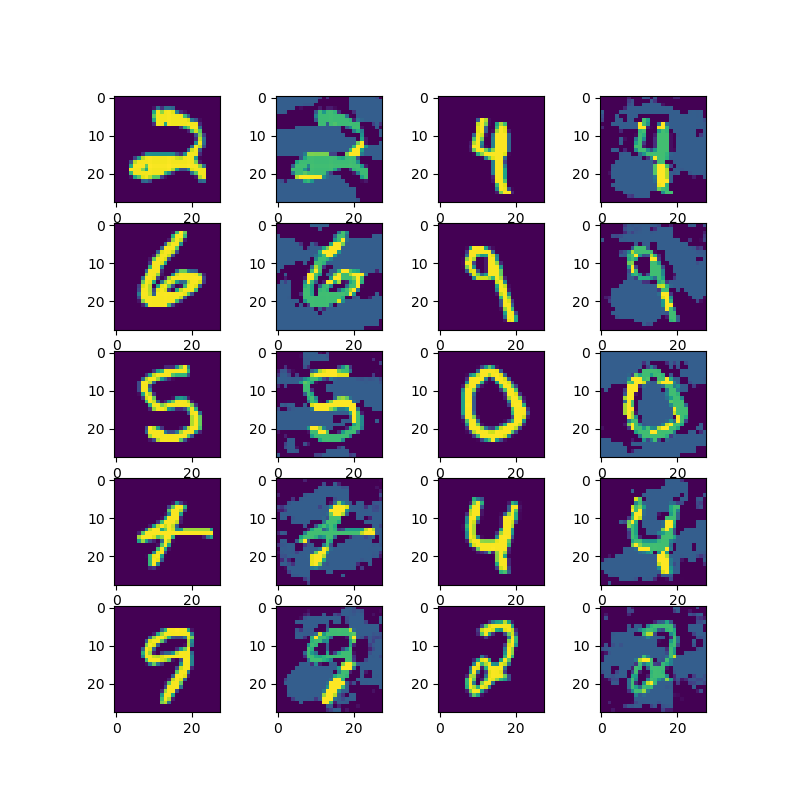
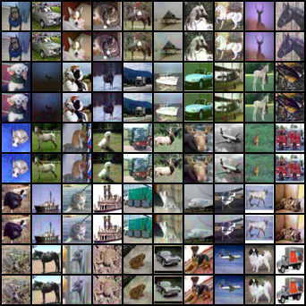
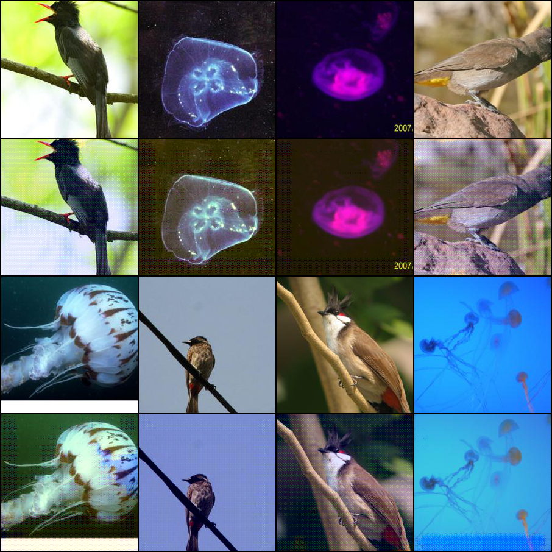

# Learning to Confuse: Generating Training Time Adversarial Data with Auto-Encoder

This is the official repository for the implementation of DeepConfuse.

This package is provided "AS IS" and free for academic usage. You can run it at your own risk. For other purposes, please contact Prof. Zhi-Hua Zhou ([zhouzh@lamda.nju.edu.cn](mailto:zhouzh@lamda.nju.edu.cn)).

Description: A pytorch implementation of DeepConfuse proposed in "Learning to Confuse: Generating Training Time Adversarial Data with Auto-Encoder". This repo contains pretrained model and our code for experiment results on MNIST, CIFAR-10 and a restrict version of ImageNet. The implementation is flexible enough for modifying the model and applying it to your own datasets.

If you find this code helpful for your research, please consider to cite our [paper](https://papers.nips.cc/paper/9368-learning-to-confuse-generating-training-time-adversarial-data-with-auto-encoder):
```
@inproceedings{feng2019learning,
  title={Learning to Confuse: Generating Training Time Adversarial Data with Auto-Encoder},
  author={Feng, Ji and Cai, Qi-Zhi and Zhou, Zhi-Hua},
  booktitle={Advances in Neural Information Processing Systems},
  pages={11971--11981},
  year={2019}
}
```
## Environments
* The code is developed under Python 3.6, we recommend to create a Python 3.6 environment using anaconda.
```
conda create -n deepconfuse python=3.6 anaconda
```

* Install the dependent packages
```
conda install pytorch torchvision cudatoolkit=10.1 -c pytorch
pip install tensorboardX
```

## Expriments
### MNIST Dataset
* Download Data
```
cd MNIST
python downloaddata.py
```
* Train Auto-Encoder
```
python train.py --save-model
```
* Test the training time adversarial data generated by Auto-Encoder
```
python test_model.py --path your/path/to/attackmodel
```
* We also provide pretrained Auto-Encoder model. To test it, use
```
python test_model.py --path pretrained/atkmnist_best.pt
```
* Use `--modelsize` to choose different victim CNNs, like
```
python test_model.py --path pretrained/atkmnist_best.pt --modelsize small
python test_model.py --path pretrained/atkmnist_best.pt --modelsize large
```
* Generate training-time adversarial data by
```
 python generate_adv_data.py --model-path pretrained/atkmnist_best.pt
```
It will create `training_adv.pt` and `test_adv.pt`, you can visulize origin training data and adversarial training data by
```
python vis.py
```
The results will be saved in `mnist.png` like

* After generating Training-Time adversarial data, you can evaluate the training time attack for SVM and Random Forest by
```
python test_rf_svm.py
```
* For label-specific setting, train Auto-Encoder using the following command:
```
python train_targeted.py --save-model
```
* Test the Auto-encoder for label-specific setting(We provide pretrained model, too):
```
python test_model.py --path pretrained/atkmnist_target_best.pt --targeted
```

### CIFAR-10 Dataset
We refers the implementation of https://github.com/kuangliu/pytorch-cifar in our expriments. For original results of different deep learning models in CIFAR-10, please refer to that repo.
* Train Auto-Encoder(needs about 5-7 days on a single GPU)
```
cd CIFAR
python train.py
```
* Test the training time adversarial data generated by Auto-Encoder. Note that this code supports multi-GPU and may use all available ones, you should use CUDA_VISIBLE_DEVICES=x,x to set which GPUs you want to use.
```
python test_cifar.py --path pretrained/atk.0.032.best.pth
```
It will output training accuracy, validation accuracy, and test accuracy. Note that validation data and training data are all training-time adversarial data while test data are clean.

Also, this script will generate a visulization of training-time adversarial data, it random sample 50 origin training data and plot the adversarial and origin image in `cifar.png` like this:



* You can try different model architecture by changing line 90 in `test_cifar.py`

### Two-class ImageNet Dataset
We use images from 2 classes in original ImageNet dataset. Please download ImageNet Dataset in advance and use the following script to process validation data: https://raw.githubusercontent.com/soumith/imagenetloader.torch/master/valprep.sh

* Copy `n01560419` and `n01910747` from original imagenet dataset into `train` and `val` folder
* Move last 190 images from `train/n01560419` and `train/n01910747` into `vali/n01560419` and `vali/n01910747`. We use these images as validation data while we use the origin validation data (in `val` folder) as test data.
* You can choose other classes in ImageNet or other similar data as you like, just by keeping the same file structure.

Train Auto-Encoder by
```
cd ImageNet
python train_binary.py
```

Generate training time adversarial data by
```
python make_poison_binary.py --path pretrained/atk.0.100.best.pth
```
It will also visulize origin data and adversarial training data in `imagenet.png` like this:


Test model performance of original training data by
```
python test_binary.py --poisonratio 0 --arch normal
```
Specify model architecture using `--arch`, it supports `small`,`normal`,`large`,`resnet`,`densenet`. We use pytorch official ResNet50 and DenseNet121 implementation.

Test this training-time adversarial data by
```
python test_binary.py --poisonratio 1 --arch normal
```
Due to the dataset is small(it only has 100 test data). The result has a large variance, you should run multiple times using different seeds. 
